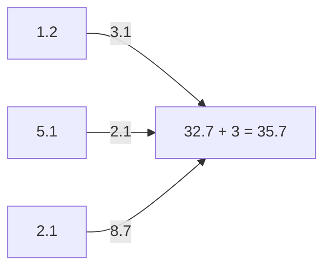

# Extension

[Markdown Preview Mermaid Support](https://marketplace.visualstudio.com/items?itemName=bierner.markdown-mermaid)

# Mermaid diagram for neural network

# Explain neural network

- Input layer has 3 neurons
- Output layer has 1 neuron
- No hidden layers